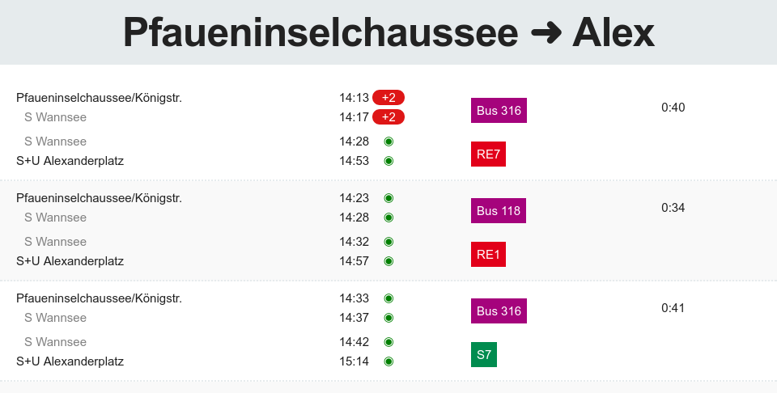

# simple-vbb
Tired of typing the same station names again and again on vbb.de or bvg.de? `simple-vbb` offers an easier access that you can personalize to your needs. You can access an often used route by a simple link such as `http://<simple-vbb-root>/Alexanderplatz-to-Hauptbahnhof`. Add this to your bookmarks and you can check the current delays with a single click.

## Installation
`simple-vbb` works with both Python 2 and 3. Just install the requirements via

    pip install -r requirements.txt

You also need an API key for the VBB api.
The procedure is uncomplicated and described on the [VBB webpage](http://www.vbb.de/de/article/fahrplan/webservices/schnittstellen-fuer-webentwickler/5070.html) (German).
In short, just write an email to api@vbb.de asking for access to the REST interface on the test server. No need to write a long application.
Then create the file `access_key.txt` in the root folder. The API key should be the single line in this file.

## Running

Start the website with `make run`. This starts [Flask](http://flask.pocoo.org/) on localhost on port 5000. To get the results for a route, simply open

    http://localhost:5000/<from>-to-<to>

Examples:

    http://localhost:5000/stadtmitte-to-wannsee
    http://localhost:5000/Alexanderplatz-to-Stadtmitte
    http://localhost:5000/S Spandau-to-Lichterfelde Ost (spaces will be escaped by browser)

The website looks as follows (`http://localhost:5000/pfaueninselchaussee-to-alex`):

Note: I have not tested on anything but my PC/browser/screen resolution.
Also, there is not much error handling implemented so use only as intended.
Please exercise fair use.

## Feature missing? Other use case?
I'm open to feature requests in line with the spirit of the tool.
